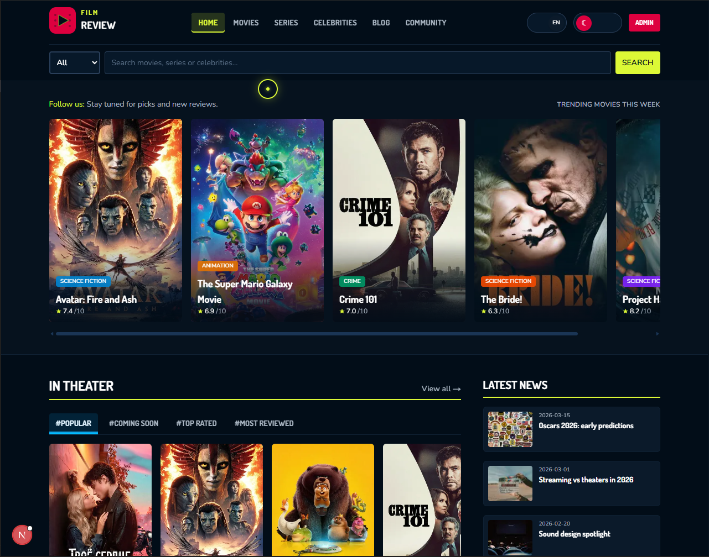

# Film Review Movie

Next.js tabanli, TMDB ile zenginlestirilebilen bir film/dizi kesif ve inceleme uygulamasi.  
Proje; yerel JSON verileri, cok dilli arayuz (TR/EN), blog ve temel bir admin paneli ile portfoy/demo amacli tasarlanmistir.

## Ozellikler

- Film, dizi ve unlu listeleri ile detay sayfalari
- TMDB entegrasyonu (API anahtari varsa canli veri)
- Yerel JSON fallback verileri (`data/` klasoru)
- Blog icerikleri ve yazi detay sayfalari
- Topluluk/profil/favori/rating demo ekranlari
- Admin panelinden film, dizi, unlu ve blog icerigi yonetimi
- `tr` / `en` dil destegi (cookie tabanli)
- Docker ile calistirma destegi

## Teknoloji Yigini

- `Next.js 16` (App Router)
- `React 19`
- `TypeScript`
- `Tailwind CSS 4`
- `GSAP` / `@gsap/react`

## Ekranlar ve Moduller

- Site: `/`
- Filmler: `/movies`
- Diziler: `/series`
- Unluler: `/celebrities`
- Blog: `/blog`
- Topluluk: `/community/*`
- Admin giris: `/admin/login`
- Admin panel: `/admin`

## Baslangic

### 1) Gereksinimler

- `Node.js 20+`
- `npm` (veya uyumlu paket yoneticisi)

### 2) Kurulum

```bash
npm install
```

### 3) Ortam Degiskenleri

Proje kokune `.env.local` dosyasi olusturun:

```bash
# zorunlu degil ama siddetle onerilir
TMDB_API_KEY=your_tmdb_api_key

# admin panel sifresi (tanimlanmazsa varsayilan: admin123)
ADMIN_PASSWORD=your_strong_password

# opsiyonel - canonical URL/SEO
NEXT_PUBLIC_SITE_URL=http://localhost:3000
```

TMDB API anahtari: [themoviedb.org/settings/api](https://www.themoviedb.org/settings/api)

### 4) Gelistirme Sunucusu

```bash
npm run dev
```

Uygulama: [http://localhost:3000](http://localhost:3000)

## Docker ile Calistirma

### Docker Compose

```bash
docker compose up --build
```

Varsayilan olarak:

- Uygulama `3000` portunda calisir
- `data/` klasoru container icinde `/app/data` olarak mount edilir
- `ADMIN_PASSWORD` compose ortamindan alinabilir

## Kullanilabilir Script'ler

```bash
npm run dev    # gelistirme
npm run build  # production build
npm run start  # production server
npm run lint   # eslint
npm run tmdb:test   # TMDB_API_KEY ile API'ye tek istek (configuration)
```

### TMDB baglantisini test etme

1. `.env.local` icinde `TMDB_API_KEY=...` tanimli olsun.
2. Proje kokunde: `npm run tmdb:test`
3. Basarida `Basarili — API anahtari calisiyor` ve ornek `images.base_url` yazilir; aksi halde HTTP kodu veya ag hatasi (proxy, firewall) gorunur.

Tarayicidan da kontrol icin (anahtari URL'de paylasmayin; sadece lokal deneme):  
`https://api.themoviedb.org/3/configuration?api_key=ANAHTARINIZ`

**`tmdb:test` calisiyor ama sitede TMDB gorunmuyorsa:** `npm run tmdb:test` Node ile `.env.local` dosyasini kendisi okur; Next.js ise degiskenleri **yalnizca `npm run dev` (veya `build`) baslarken** yukler. `.env.local` kaydettikten sonra gelistirme sunucusunu **durdurup yeniden baslatin**. Gelistirmede tarayicida `http://localhost:3000/api/dev/tmdb-status` acin: `isTmdbConfigured: true` degilse Next hala anahtari gormuyordur (dosya adi, proje kok dizini, degisken adi `TMDB_API_KEY`).

**Yerel film sayfalari:** `/movies/interstellar` gibi `data/movies.json` sluglari TMDB detayi degildir; TMDB birlesik liste `tmdb-movie-...` slugli kartlardan veya TMDB katalog bolumunden gorulur.

## Veri Katmani

Uygulama, verileri JSON dosyalarindan okur:

- `data/movies.json`
- `data/series.json`
- `data/celebrities.json`
- `data/posts.json`
- `data/user.json`

Admin islemleri bu dosyalari gunceller. Docker kullaniyorsaniz `./data` volume oldugu icin degisiklikler kalici olur.

## Admin Kimlik Dogrulama

- Giris endpoint'i: `POST /api/admin/login`
- Basarili giriste `admin_session` cookie olusturulur
- `proxy` ile `/admin/*` ve `/api/admin/*` rotalari korunur

Guvenlik notu:

- Uretimde mutlaka `ADMIN_PASSWORD` tanimlayin
- Varsayilan sifre (`admin123`) sadece demo/gelistirme icin uygundur

## Proje Yapisi (Ozet)

```text
src/
  app/          # App Router sayfalari ve API route'lari
  components/   # UI bilesenleri
  lib/          # yardimci fonksiyonlar, i18n, veri ve servis katmani
data/           # yerel JSON verileri
public/         # statik varliklar
```

## Notlar

- TMDB anahtari yoksa uygulama yine calisir; canli TMDB icerikleri yerine yerel/ornek veriler gorunur.
- Bu proje demo/portfoy odaklidir; topluluk/profil bolumlerinin bir kismi simulasyon niteligindedir.
- TMDB kullanim bildirimi uygulama icinde yer alir.
